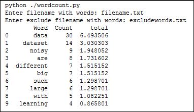
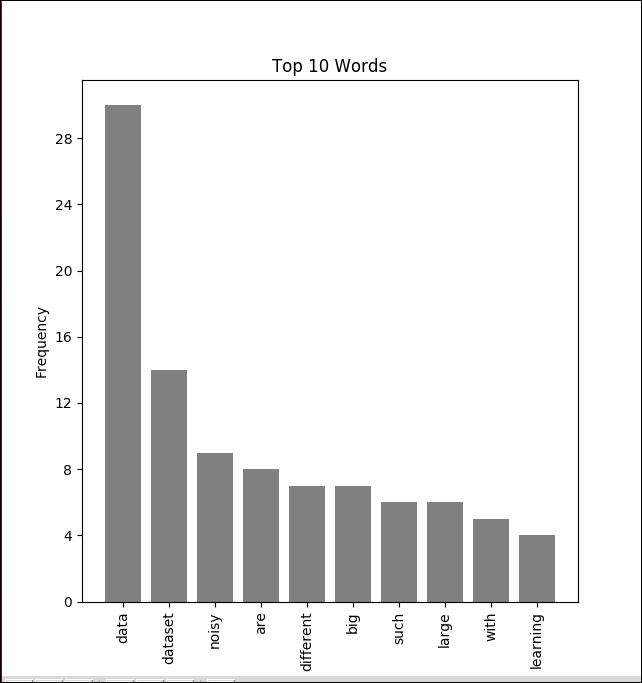

### Word Count ###
Program to count the frequency of words in a document. It takes two files as input. First file contains list words to be counted.  
Second file contains another set of words which needs to be excluded from the count. These words can also be numbers.

### Exclude file contents ###
the or and is of a to  in that can as from it contradictions contradictory
 
### Sample output ###

  
  

